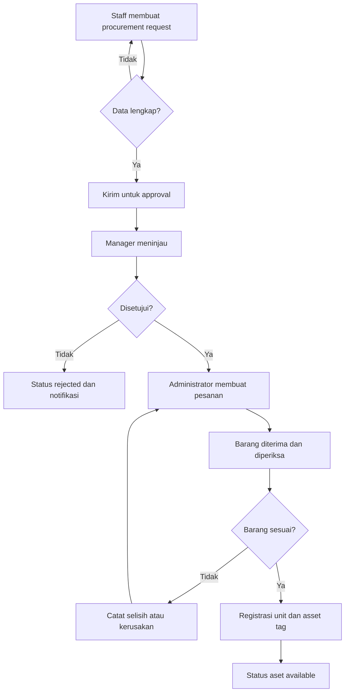
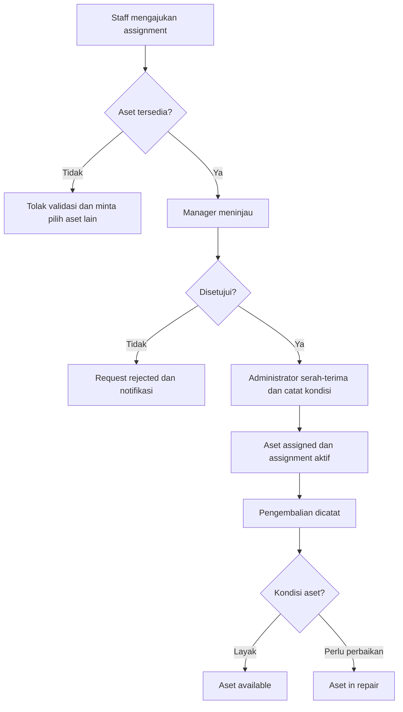
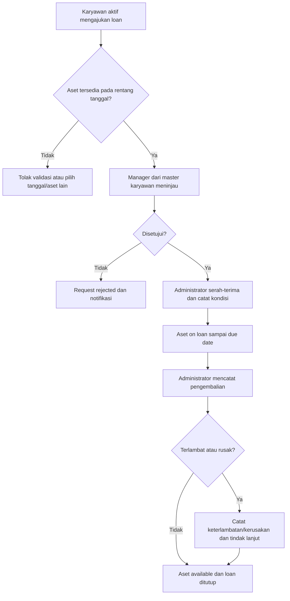
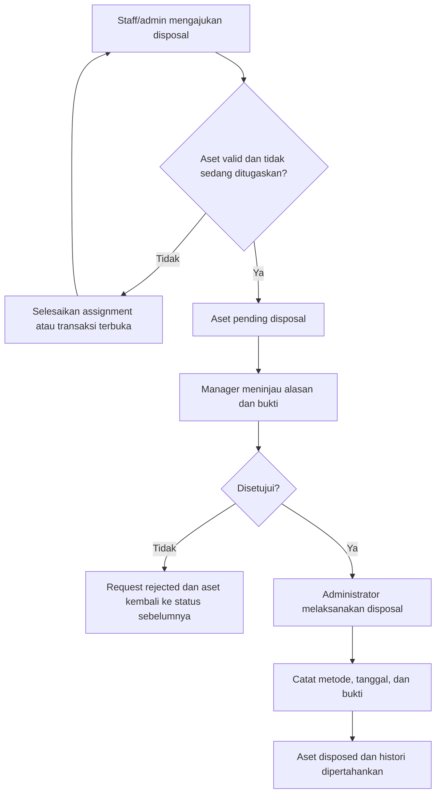
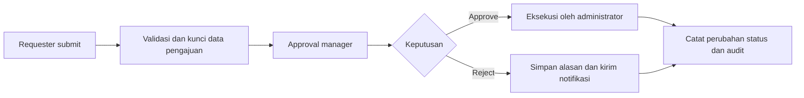
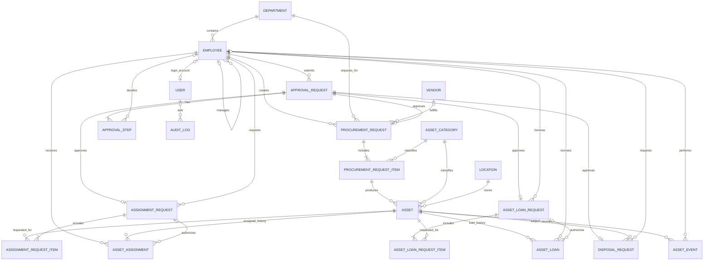

# Rancangan Bisnis Proses dan Desain Asset Management

> Dokumen ini adalah rancangan awal berdasarkan kebutuhan: pengelolaan aset kantor dari procurement sampai penghapusan, termasuk persetujuan staff-manager. Workspace saat ini belum memiliki implementasi, sehingga teknologi, integrasi, dan kebijakan operasional di bawah perlu dikonfirmasi sebelum pembangunan.

## 1. Tujuan dan Ruang Lingkup

Sistem menjadi sumber data utama aset kantor dan riwayatnya, mulai dari permintaan pengadaan, penerimaan, pencatatan, penempatan, penugasan kepada staff, pemeliharaan, hingga penghapusan. Semua permintaan yang mengubah komitmen biaya atau kepemilikan/penguasaan aset mengikuti approval dan tercatat dalam audit trail.

**Dalam cakupan:**
- Master karyawan sebagai sumber identitas organisasi, manager, departemen, dan status kerja; akun login ditautkan bila karyawan memakai sistem.
- Master aset, kategori, lokasi, departemen, dan vendor.
- Procurement request, approval manager, penerimaan barang, dan registrasi aset.
- Assignment aset jangka panjang dan peminjaman aset sementara, keduanya dengan persetujuan manager.
- Pemindahan, pengembalian, serta pencatatan kondisi aset.
- Permintaan penghapusan aset dengan persetujuan manager dan pencatatan hasilnya.
- Riwayat approval, aktivitas, dokumen pendukung, dan notifikasi.

**Di luar cakupan awal (dapat menjadi fase berikutnya):** akuntansi/depresiasi dan jurnal keuangan, integrasi ERP, inventaris consumable, pengadaan otomatis, serta aplikasi mobile khusus.

## 2. Peran dan Hak Akses

| Peran | Tanggung jawab utama |
|---|---|
| Staff / Requester | Membuat permintaan procurement, assignment, peminjaman, atau disposal; melihat status dan aset yang menjadi tanggung jawabnya. |
| Manager / Approver | Menyetujui atau menolak permintaan dari staff dalam cakupan tim/departemennya, dengan catatan keputusan. |
| Asset Administrator | Mengelola master data, menindaklanjuti permintaan yang disetujui, menerima barang, menyerahkan/menerima kembali aset, dan menyelesaikan disposal. Tidak boleh menyetujui permintaan sendiri kecuali memiliki peran approver terpisah dan kebijakan mengizinkan. |
| System Administrator | Mengelola akun, role, konfigurasi, dan referensi organisasi; tidak otomatis memiliki wewenang menyetujui transaksi. |
| Auditor / Read-only | Melihat data dan riwayat tanpa mengubah transaksi. |

### Master Karyawan

`EMPLOYEE` adalah sumber data resmi untuk identitas dan struktur organisasi; `USER` adalah akun autentikasi/otorisasi aplikasi. Seorang karyawan dapat belum memiliki akun login, tetapi tetap dapat dipilih sebagai penerima aset atau peminjam. Jika akun dibuat, `USER.employee_id` menautkannya ke tepat satu karyawan. Role aplikasi tetap disimpan pada akun, bukan pada master karyawan.

Data minimum karyawan: nomor karyawan unik, nama, email kerja, departemen, atasan langsung (`manager_employee_id`), jabatan, status kerja (`ACTIVE`, `ON_LEAVE`, `INACTIVE`), tanggal mulai/akhir kerja, dan lokasi kerja. Sinkronisasi dari HRIS dapat menjadi sumber utama bila tersedia; jika dikelola manual, perubahan dicatat dengan audit trail. Karyawan nonaktif tidak dapat membuat permintaan baru atau ditetapkan sebagai peminjam/penerima baru, tetapi tetap muncul pada histori transaksi lama.

Sistem menentukan approver dari atasan langsung karyawan requester berdasarkan snapshot organisasi saat permintaan dikirim. Simpan `approver_employee_id` pada approval step agar perubahan manager berikutnya tidak mengubah pemilik approval yang sedang berjalan. Jika manager tidak aktif/kosong atau requester dan manager adalah orang yang sama, gunakan jalur eskalasi/pengganti yang dikonfigurasi; jangan melewati approval.

## 3. Siklus Hidup Aset

`Draft procurement -> Menunggu approval -> Disetujui -> Dipesan -> Diterima -> Tersedia -> Ditugaskan atau Dipinjam -> Dikembalikan/tersedia -> Menunggu disposal -> Dihapus`

Aset dapat pula berstatus `Dalam perbaikan`, `Hilang`, atau `Ditolak saat penerimaan` sesuai kebijakan. Status `Dihapus` bersifat final untuk operasi normal; koreksi dilakukan melalui proses audit, bukan mengaktifkan kembali record secara langsung.

## 4. Proses Bisnis

### 4.1 Procurement
1. Staff mengisi permintaan: alasan/kebutuhan, kategori dan spesifikasi, jumlah, estimasi biaya, departemen, tanggal dibutuhkan, serta lampiran/quotation bila ada.
2. Staff mengirim permintaan. Sistem memvalidasi kelengkapan dan membuat approval request berstatus `PENDING`.
3. Manager yang berwenang meninjau rincian dan memilih `Approve` atau `Reject`, dengan komentar. Keputusan dan waktunya dicatat.
4. Jika ditolak, permintaan menjadi `REJECTED`; requester mendapat notifikasi dan dapat mengajukan permintaan baru atau mengubah draft sesuai kebijakan. Keputusan final tidak ditimpa.
5. Jika disetujui, Asset Administrator melakukan pemesanan dan mengisi vendor/nomor PO. Status bergerak ke `ORDERED`.
6. Saat barang diterima, administrator mencatat tanggal, jumlah, kondisi, dokumen penerimaan, dan nomor seri. Selisih/kerusakan dicatat sebagai pengecualian.
7. Setiap unit yang diterima dibuat sebagai record aset tersendiri dengan asset tag unik. Aset siap dipakai menjadi `AVAILABLE`; procurement ditutup setelah seluruh item diterima atau selisih diselesaikan.

### 4.2 Assignment dan Pengembalian
1. Staff atau Asset Administrator membuat permintaan assignment jangka panjang dengan memilih satu atau lebih aset `AVAILABLE`, karyawan penerima aktif dari master karyawan, lokasi, tujuan, dan tanggal mulai.
2. Sistem memeriksa status aset dan karyawan, lalu menentukan approver dari manager penerima pada master karyawan. Permintaan dapat diajukan oleh admin untuk penerima, tetapi tetap disetujui manager penerima.
3. Setelah disetujui, Asset Administrator melakukan serah-terima, mencatat kondisi, tanggal, dan bukti penerimaan. Status aset menjadi `ASSIGNED` dan histori assignment aktif.
4. Pengembalian dicatat oleh administrator: tanggal dan kondisi saat kembali. Assignment ditutup; aset menjadi `AVAILABLE`, `IN_REPAIR`, atau status lain berdasarkan inspeksi.
5. Perpindahan penerima/lokasi yang berdampak pada tanggung jawab dibuat sebagai permintaan assignment/perpindahan baru dan mengikuti approval, bukan mengubah histori lama.

### 4.3 Peminjaman Aset
1. Karyawan aktif mengajukan loan untuk penggunaan sementara, memilih aset `AVAILABLE`, tujuan, lokasi pemakaian, tanggal mulai, serta tanggal rencana kembali. Admin dapat mengajukan atas nama karyawan.
2. Sistem memvalidasi ketersediaan aset pada rentang tanggal yang diminta, status peminjam, dan tidak adanya loan/assignment yang bertabrakan. Manager peminjam yang ditentukan dari master karyawan menyetujui atau menolak.
3. Setelah disetujui, administrator menyerahkan aset dan mencatat kondisi, waktu keluar, serta bukti serah-terima. Loan aktif; aset berstatus `ON_LOAN` dan tidak dapat dipilih untuk transaksi lain.
4. Pengembalian dicatat administrator dengan waktu aktual dan kondisi. Loan ditutup; aset kembali `AVAILABLE` atau masuk `IN_REPAIR`. Sistem menandai keterlambatan bila tanggal aktual melewati tanggal rencana dan memberi notifikasi kepada peminjam serta administrator.
5. Perpanjangan tanggal kembali dilakukan melalui permintaan perubahan yang disetujui manager. Sistem memeriksa ulang ketersediaan sebelum memperbarui due date; histori due date sebelumnya tetap tersimpan.

### 4.4 Penghapusan (Disposal)
1. Staff atau Asset Administrator mengajukan disposal untuk aset yang tidak ekonomis, rusak, usang, hilang, atau alasan lain; cantumkan alasan, kondisi, bukti, serta metode disposal yang direncanakan.
2. Sistem memvalidasi bahwa aset ada dan tidak sedang memiliki transaksi terbuka. Aset yang masih ditugaskan harus dikembalikan atau assignment-nya diselesaikan lebih dulu.
3. Manager meninjau dan menyetujui/menolak. Selama menunggu, aset berstatus `PENDING_DISPOSAL` dan tidak dapat di-assign atau dipindahkan.
4. Jika ditolak, aset kembali ke status operasional sebelumnya dan requester diberi alasan.
5. Jika disetujui, administrator melaksanakan disposal sesuai kebijakan perusahaan lalu mencatat tanggal aktual, metode, penerima/hasil bila relevan, dan bukti.
6. Setelah bukti dan pelaksanaan diverifikasi, aset menjadi `DISPOSED`. Record aset tidak dihapus dari database; histori dan tautan dokumen tetap tersedia untuk audit.

## 5. Flowchart

### 5.1 Siklus Procurement sampai Registrasi Aset

### 5.2 Approval Assignment

### 5.3 Approval Peminjaman Aset

### 5.4 Approval Penghapusan Aset

### 5.5 Pola Approval Umum

## 6. Desain Data dan ERD

Approval dipisahkan sebagai entitas bersama yang direferensikan oleh setiap jenis permintaan. Dengan demikian, riwayat persetujuan tidak bergantung pada kolom `entity_type/entity_id` yang sulit dijaga referential integrity-nya. ERD ini adalah model logis; tipe data dan normalisasi fisik disesuaikan dengan database yang dipilih.

### Entitas utama

| Entitas | Data penting / aturan |
|---|---|
| `EMPLOYEE` | `id`, nomor karyawan unik, nama, email kerja, `department_id`, `manager_employee_id`, jabatan, status kerja, tanggal mulai/akhir, lokasi kerja. Menjadi sumber approver, requester, penerima assignment, dan peminjam. |
| `USER` | `id`, `employee_id` opsional/unik, credential atau identity provider, role aplikasi, status akun. Akun adalah identitas login; karyawan tanpa akun tetap bisa menjadi penerima/peminjam. |
| `DEPARTMENT` | `id`, nama, kode, status. Menentukan cakupan organisasi dan approval. |
| `ASSET_CATEGORY` | `id`, nama, kode, aturan penomoran/depresiasi opsional. |
| `LOCATION` | `id`, nama, alamat/kantor, parent location opsional. |
| `VENDOR` | `id`, nama, kontak, data vendor opsional. |
| `PROCUREMENT_REQUEST` | `id`, requester employee, departemen, alasan, status, estimasi total, vendor/PO opsional, tanggal submit/terima. |
| `PROCUREMENT_REQUEST_ITEM` | `id`, request, kategori, spesifikasi, jumlah, estimasi harga satuan. Saat penerimaan, setiap unit yang diterima dapat menghasilkan satu aset. |
| `ASSET` | `id`, asset tag unik, kategori, item procurement opsional, serial number unik bila ada, lokasi, status, tanggal beli/garansi, nilai beli, kondisi. Jangan hard-delete aset yang sudah tercatat. |
| `APPROVAL_REQUEST` | `id`, requester employee, status keseluruhan, submitted/closed timestamp. Tepat satu dari procurement, assignment, loan, atau disposal mereferensikan record ini. |
| `APPROVAL_STEP` | `id`, approval request, `approver_employee_id` snapshot, urutan, status, komentar, waktu keputusan. Satu step manager pada MVP; mendukung multi-level di masa depan. |
| `ASSIGNMENT_REQUEST` | `id`, approval request, requester employee, penerima employee, tujuan, lokasi tujuan, status. |
| `ASSIGNMENT_REQUEST_ITEM` | `id`, assignment request, asset; aset harus available ketika diajukan dan diverifikasi ulang saat eksekusi. |
| `ASSET_ASSIGNMENT` | `id`, asset, penerima employee, assignment request opsional, tanggal serah/kembali, kondisi saat serah/kembali. Satu aset maksimal memiliki satu assignment aktif. |
| `ASSET_LOAN_REQUEST` | `id`, approval request, requester employee, tujuan, lokasi pemakaian, tanggal mulai dan due date yang diminta, status. Manager peminjam berasal dari master karyawan. |
| `ASSET_LOAN_REQUEST_ITEM` | `id`, loan request, asset; satu request dapat memuat beberapa aset, dengan validasi availability untuk seluruh periode. |
| `ASSET_LOAN` | `id`, asset, borrower employee, request opsional, checkout/due/actual return timestamps, kondisi keluar/masuk, status. Due date dapat diperpanjang hanya melalui approval dan perubahan dicatat. Satu aset maksimal memiliki satu loan aktif. |
| `DISPOSAL_REQUEST` | `id`, approval request, asset, alasan, metode rencana, bukti, status, tanggal disposal aktual. |
| `ASSET_EVENT` | Histori domain seperti penerimaan, perubahan lokasi/status, penyerahan, peminjaman, pengembalian, perbaikan, dan disposal. Append-only untuk pengguna aplikasi. |
| `AUDIT_LOG` | Aktor, waktu, aksi, tipe dan ID record, nilai sebelum/sesudah yang relevan, request/correlation ID. Append-only untuk pengguna aplikasi. |

**Constraint penting:** nomor karyawan dan asset tag unik; satu akun tertaut maksimal ke satu karyawan; satu aset maksimal punya satu assignment aktif atau loan aktif (tidak boleh keduanya), serta satu disposal terbuka; tanggal loan tidak boleh tumpang tindih dengan penggunaan aset lain; approval hanya dapat diputuskan oleh approver yang dituju; keputusan yang telah dibuat immutable; status request dan aset berubah dalam satu transaksi database; perubahan nilai penting masuk audit log. Gunakan soft-delete hanya untuk master data yang belum dipakai transaksi.

## 7. Status Transaksi

| Objek | Status yang disarankan |
|---|---|
| Approval | `DRAFT`, `PENDING`, `APPROVED`, `REJECTED`, `CANCELLED` |
| Procurement | `DRAFT`, `PENDING_APPROVAL`, `REJECTED`, `APPROVED`, `ORDERED`, `PARTIALLY_RECEIVED`, `RECEIVED`, `CANCELLED` |
| Assignment request | `DRAFT`, `PENDING_APPROVAL`, `REJECTED`, `APPROVED`, `FULFILLED`, `CANCELLED` |
| Loan request | `DRAFT`, `PENDING_APPROVAL`, `REJECTED`, `APPROVED`, `FULFILLED`, `CANCELLED` |
| Asset loan | `CHECKED_OUT`, `OVERDUE`, `RETURNED`, `CANCELLED` |
| Asset | `AVAILABLE`, `ASSIGNED`, `ON_LOAN`, `IN_REPAIR`, `PENDING_DISPOSAL`, `DISPOSED`, `LOST` |
| Disposal request | `DRAFT`, `PENDING_APPROVAL`, `REJECTED`, `APPROVED`, `COMPLETED`, `CANCELLED` |

Transisi hanya dilakukan melalui aksi domain yang berwenang, bukan edit status bebas. Request yang sudah disubmit sebaiknya tidak diedit; requester membatalkan atau membuat revisi/permintaan baru sesuai aturan.

## 8. Desain Aplikasi

### Modul
- **Dashboard:** jumlah aset per status/lokasi/kategori; permintaan menunggu approval; procurement dan garansi mendekati tenggat.
- **Asset Register:** pencarian/filter asset tag, kategori, serial number, lokasi, pemegang, status; detail aset menampilkan timeline lengkap.
- **Requests:** form dan daftar procurement, assignment, peminjaman, serta disposal dengan status dan lampiran.
- **Approval Inbox:** antrean manager, ringkasan dampak, dokumen, tombol approve/reject dengan komentar wajib untuk penolakan.
- **Operations:** penerimaan procurement, serah-terima/pengembalian, perbaikan, dan penyelesaian disposal.
- **Administration & Reports:** master karyawan dan struktur manager, akun/role, departemen, lokasi, kategori, vendor, export, dan audit.

### Arsitektur aplikasi yang disarankan
Untuk tahap awal, gunakan aplikasi modular monolith dengan batas domain `Identity & Organization` (termasuk master karyawan dan sinkronisasi HRIS), `Asset Registry`, `Procurement`, `Assignment`, `Asset Loan`, `Approval`, `Disposal`, `Notification`, dan `Audit`. Satu relational database menjaga konsistensi transaksi aset dan approval. Lampiran disimpan pada object/file storage dengan metadata serta kontrol akses; database menyimpan referensi, bukan isi file besar. Notifikasi email/in-app dikirim setelah commit, idealnya melalui outbox agar tidak hilang ketika layanan email bermasalah.

UI web responsif dengan navigasi sesuai role. Server tetap menjadi otoritas untuk otorisasi dan validasi; menyembunyikan tombol di UI bukan kontrol keamanan. Semua endpoint mutasi memeriksa role, cakupan manager, status saat ini, serta kepemilikan request.

## 9. Aturan Approval dan Keamanan

- Staff hanya dapat membuat/melihat permintaan sesuai cakupan akses; manager hanya dapat memutuskan step yang dialokasikan kepadanya.
- Identitas requester, manager, penerima, dan peminjam divalidasi terhadap master karyawan. Status kerja dan struktur manager diperiksa saat submit; approver yang ditetapkan disimpan sebagai snapshot pada approval step.
- Manager harus berbeda dari requester. Gunakan approver pengganti/escalation yang eksplisit jika struktur manager kosong atau tidak aktif.
- Pengajuan, keputusan, penerimaan, serah-terima, dan disposal mencatat aktor serta timestamp. Penolakan wajib menyertakan alasan.
- Approval yang disetujui tidak langsung mengubah kondisi fisik aset: administrator harus mencatat eksekusi untuk assignment dan disposal; procurement harus mencatat penerimaan.
- Validasi ulang ketersediaan aset dan status request saat approve/execute untuk mencegah dua request bersamaan mengambil aset yang sama.
- Loan harus memiliki due date; sistem menyediakan daftar loan jatuh tempo/terlambat dan notifikasi pengingat. Perpanjangan harus melalui approval dan validasi jadwal ulang.
- Lampiran sensitif hanya dapat diakses role yang berwenang; validasi tipe/ukuran file dan catat akses/perubahan yang relevan.

## 10. Laporan dan Kriteria Penerimaan Awal

**Laporan:** register aset aktif, aset per kategori/lokasi/departemen/pemegang, histori assignment dan loan, daftar loan jatuh tempo/terlambat, procurement dan penerimaan, aset dalam perbaikan, penghapusan, garansi, serta antrean approval. Export harus mengikuti hak akses dan menyertakan waktu pembuatan laporan.

**MVP dianggap siap bila:**
1. Staff dapat mengajukan procurement dan manager terkait dapat menyetujui/menolak dengan histori keputusan.
2. Penerimaan procurement yang disetujui menghasilkan aset dengan asset tag unik dan status yang benar.
3. Manager approval ditentukan dari master karyawan dan tersimpan sebagai snapshot; karyawan tanpa akun login tetap dapat dipilih sebagai penerima/peminjam.
4. Assignment dan loan tidak dapat mengambil aset yang tidak tersedia; serah-terima/pengembalian tercatat, loan memiliki due date, dan overdue dapat dilaporkan.
5. Disposal memerlukan approval, tidak bisa dilakukan untuk aset yang masih aktif ditugaskan/dipinjam, dan mempertahankan histori setelah selesai.
6. User tidak dapat menyetujui permintaannya sendiri atau mengubah keputusan/status melalui akses yang tidak berwenang.
7. Timeline aset menampilkan kejadian penting dan seluruh aksi kritis tercatat dengan aktor dan waktu.

## 11. Keputusan yang Perlu Dikonfirmasi

- Apakah approval cukup satu tingkat manager, atau perlu batas nilai dan approval finance/director?
- Apakah master karyawan dikelola manual atau disinkronkan dari HRIS, dan sistem mana yang menjadi sumber kebenaran?
- Apakah procurement dilakukan oleh tim khusus dan perlu nomor PO serta integrasi ke sistem keuangan?
- Apakah assignment selalu diajukan oleh karyawan penerima, atau boleh diajukan manager/admin untuk karyawan?
- Apakah pinjaman aset memerlukan biaya/deposit, batas durasi, atau persetujuan tambahan selain manager?
- Metode disposal apa yang diizinkan dan siapa yang memverifikasi bukti pelaksanaan?
- Apakah depresiasi, nilai buku, stock opname, barcode/QR, dan multi-kantor diperlukan pada MVP?
- Kebijakan retensi dokumen dan audit berapa lama?
